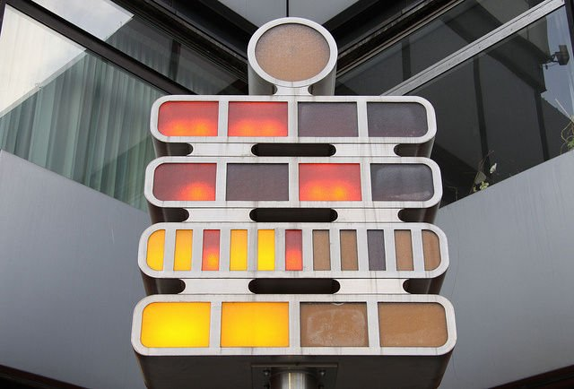
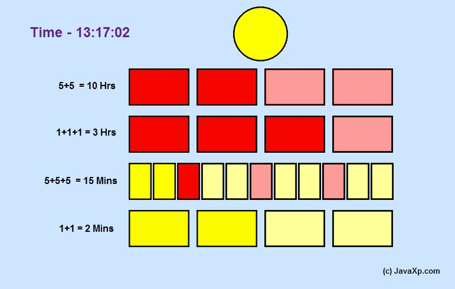

# Berlin Clock Code Kata #

This Java Code Kata is about to implementation of Berlin Clock (https://en.wikipedia.org/wiki/Mengenlehreuhr).

We will use Java8 and try to follow TDD way of coding to end with OO programing style.

# Berlin Clock #

Mengenlehreuhr is a fancy clock currently located in Budapester Straße in front of Europa-Center in Berlin.

## How to read time ##

Time is presented in 24H format in the way of turning on or off lights divided into 5 rows.
- First row from the top represents SECONDS and blinks in 1 second interval (on for even and off for odd numbers);
- Second row represents HOURS divided into 5-hours blocks;
    - so if 2 lamps is on it represents 10 AM;
- Third row represents HOURS divided into 1-hour blocks;
    - so if first 3 lamps from this row are on it represents 3 AM;
- Fourth row represents MINUTES divided into 5-minutes blocks;
    - so if 3 lamps from this row is on it means 15 minutes after midnight;
    - every third lamp in this row is red witch has no special meaning beside visual one
- Fifth row represents MINUTES divided into 1-minute blocks;
    - so if 2 lamps from this row are on it means 2 minutes after midnight;

# Goal of this Kata #

Main goal of this kata is to have a lot of fun while development.

Use TDD and play with Spock framework to implement Your tests. Remember that Java is object oriented language - use OOP (it's not Pascal).